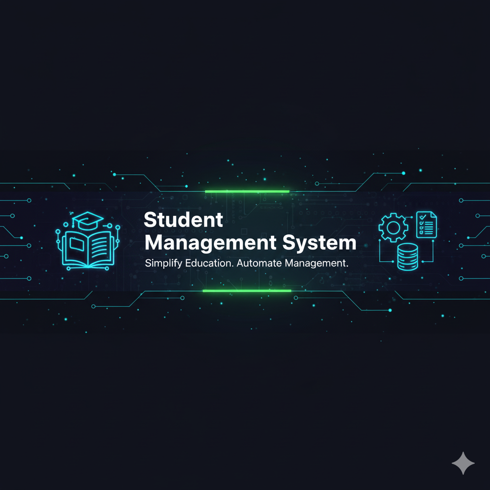

# Student Management System 🎓

## ✨ Overview
The **Student Management System** is a robust and scalable backend application designed with **Spring Boot 4** to modernize educational administrative tasks. It provides a comprehensive solution for managing student records, department tracking, and dynamic search filtering, aiming to simplify complex academic workflows.

This project emphasizes clean architecture, maintainability, and extensibility, offering a solid foundation for further enhancements.

## 🌟 Key Features
* **Dynamic Search & Filtering**: Advanced search functionality to filter students by name, surname, or email.
* **Data Validation**: Robust server-side validation using **Spring Boot Starter Validation** to ensure data integrity and professional user feedback.
* **Student Profile Management**: Complete CRUD (Create, Read, Update, Delete) operations for managing detailed student profiles.
* **Department Mapping**: Many-to-One relationship handling between students and their respective faculties/departments.
* **Responsive Dashboard**: A modern and user-friendly management interface built with **Thymeleaf**, **Bootstrap 5**, and **Font Awesome**.

## 🚀 Technologies & Tools
This project leverages a modern and powerful tech stack to ensure high performance and developer efficiency:

* **Java 21**: Utilizing the latest Long-Term Support (LTS) version for modern features and performance.
* **Spring Boot 4.x**: Leading framework for rapid application development and secure configuration.
* **Spring Data JPA / Hibernate**: For powerful and abstracted Object-Relational Mapping to interact with the database.
* **Thymeleaf**: Server-side Java template engine for generating dynamic web content.
* **MySQL / PostgreSQL**: Multi-database support for production-ready relational data persistence.
* **Maven**: A robust project management and build automation tool.
* **Lombok**: To reduce boilerplate code (getters, setters, etc.) and enhance code readability.

## 🏗️ Project Structure
The application follows a standard layered architecture for modularity and separation of concerns:

**src/main/java/com/example/studentmanagement/**
* **controller/**: Handles web requests and UI navigation.
* **service/**: Encapsulates business logic and search algorithms.
* **repository/**: Manages data persistence and custom queries.
* **entity/**: Defines the database schema (JPA Entities).
* **StudentManagementSystemApplication.java**: Application entry point.

## ⚙️ Getting Started

### Prerequisites
Before you begin, ensure you have the following installed:
* **Java Development Kit (JDK) 21** or higher
* **Maven 3.x**
* **Git**

### Installation Steps

1. **Clone the Repository:**
   `git clone https://github.com/yusuf-ozcan/student-management-system.git`
   `cd student-management-system`

2. **Build the Project:**
   `mvn clean install`

3. **Run the Application:**
   `mvn spring-boot:run`

The application will be accessible at **http://localhost:8080/students** by default.

## 🛠️ Roadmap (Future Enhancements)
* **Spring Security**: Implementation of JWT-based authentication and role-based access control.
* **Course Catalog**: Management of academic courses, credits, and associated instructors.
* **Grade Book**: Tracking student performance and automated GPA calculation.
* **RESTful API**: Exposing standardized endpoints for mobile and third-party integration.

## 📄 License
This project is licensed under the MIT License - see the [LICENSE](LICENSE) file for details.

## 📫 Contact
**Yusuf Özcan**
* **GitHub**: [@yusuf-ozcan](https://github.com/yusuf-ozcan)
* **Email**: [yusufozcan.dev@gmail.com](mailto:yusufozcan.dev@gmail.com)
